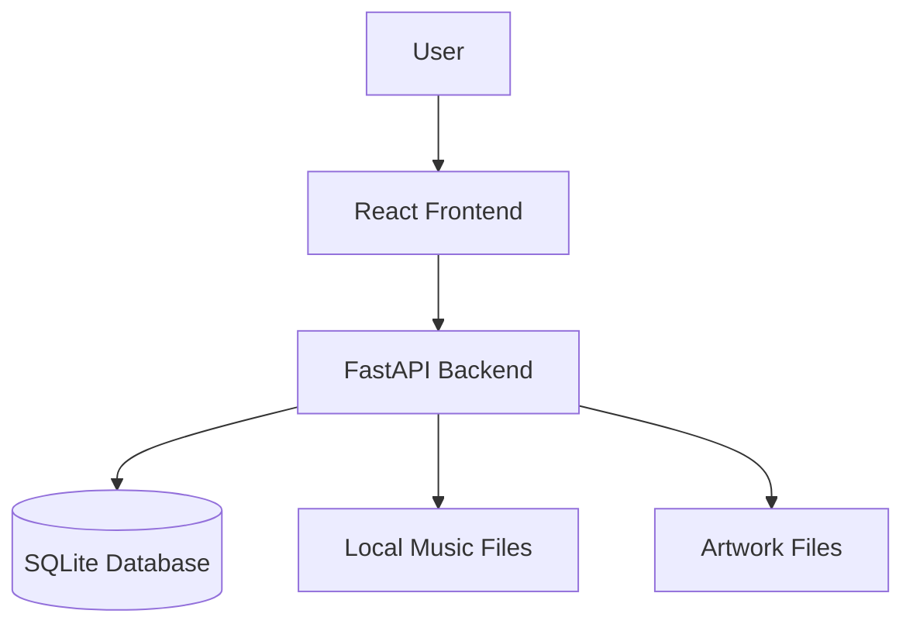
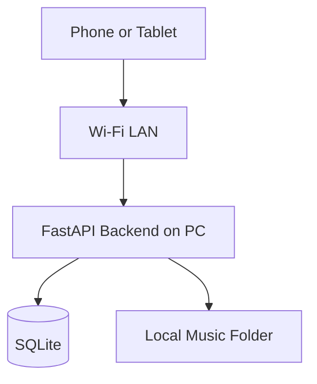
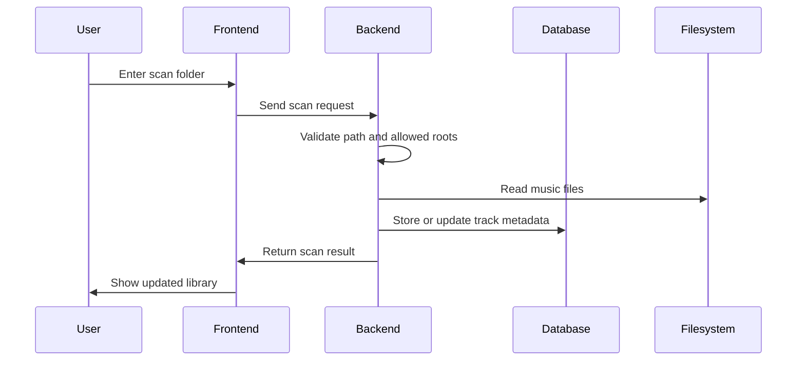
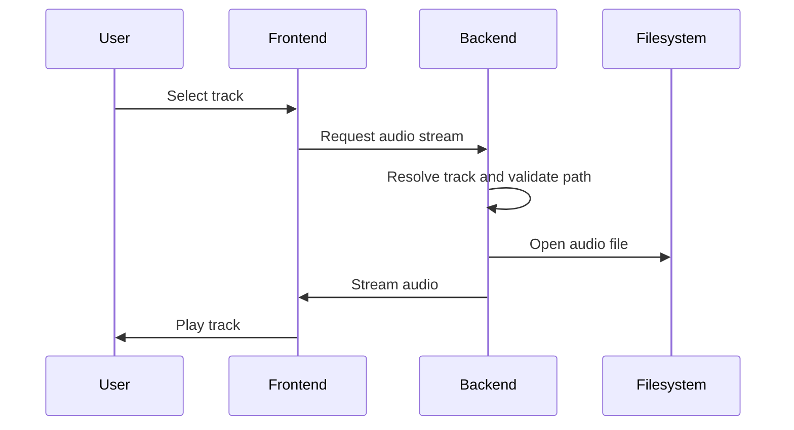
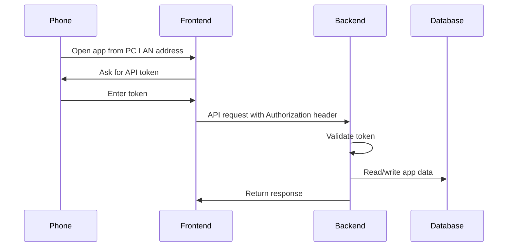
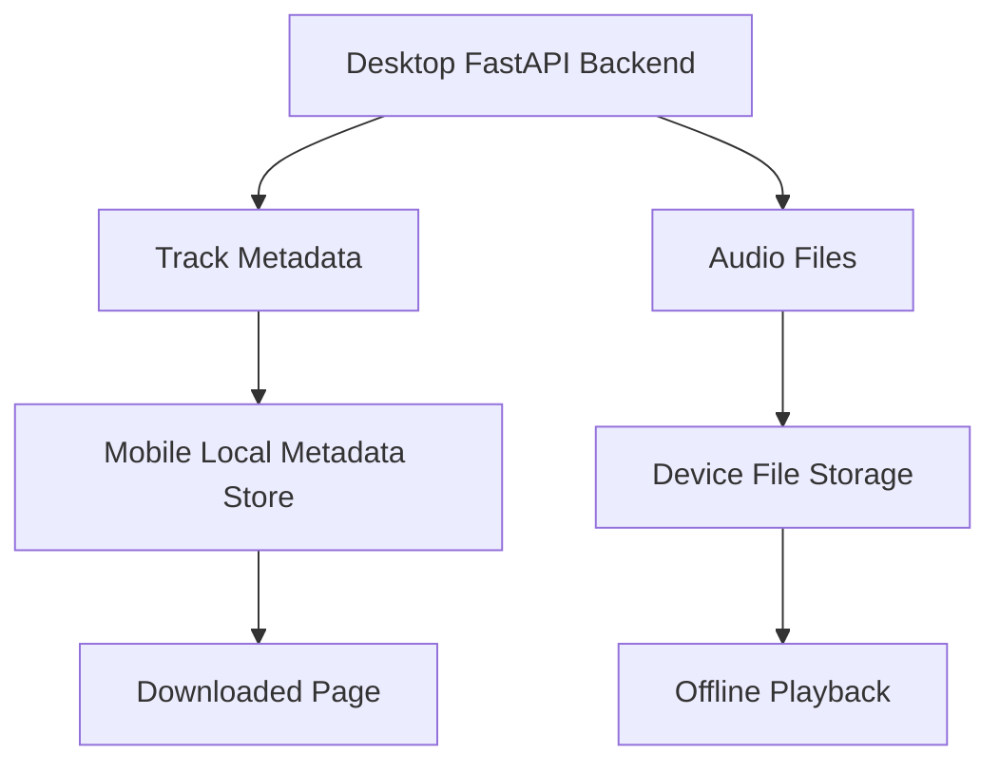

# Architecture

Smart Music Organizer is a local-first music organizer and AI playlist app.

The system is designed around one main idea: the user owns local music files, and the app provides a personal server for scanning, organizing, playing, and eventually syncing those files to a mobile device for offline playback.

This is not designed as a public hosted website. The default runtime is a local desktop server.

## Architecture Goals

The architecture is guided by these goals:

* Keep the app local-first by default.
* Store metadata locally with SQLite.
* Keep actual music files on the user's filesystem.
* Let the backend own file access, path validation, streaming, and database writes.
* Let the frontend focus on UI, playback controls, and user workflows.
* Make LAN/mobile access explicit and protected.
* Avoid exposing raw local file paths unless explicitly enabled for local debugging.
* Support Docker local-server mode for easier setup.
* Build toward mobile/offline playback with Capacitor.

## High-Level System



The React frontend communicates with the FastAPI backend through HTTP API calls.

The backend owns access to the SQLite database and the local filesystem. The frontend does not directly scan local folders or read arbitrary local music files.

## Main Components

### React Frontend

The frontend is responsible for:

* displaying the music library
* controlling audio playback
* creating and managing playlists
* calling backend API routes
* displaying tags and metadata
* handling downloaded/offline UI flows
* supporting the Capacitor Android shell direction

### FastAPI Backend

The backend is responsible for:

* scanning local music folders
* validating file paths
* extracting and storing track metadata
* serving audio streams
* serving artwork
* managing playlists
* managing tags
* applying playlist/tag logic
* enforcing LAN mode API-token protection
* serving the built React frontend in production local-server mode

### SQLite Database

SQLite stores app metadata such as:

* tracks
* playlists
* playlist-track relationships
* tags
* track-tag relationships
* tag reference data
* app metadata needed for library organization

SQLite fits the project because the app is local-first and does not require a separate database server.

### Local Filesystem

The filesystem stores the actual music files and artwork files.

The database stores metadata and paths, but the audio files themselves remain on disk.

## Runtime Modes

The app supports several runtime modes.

### Development Mode

The backend and frontend run separately.

```txt
React/Vite dev server → FastAPI backend → SQLite/filesystem
```

This mode is used while editing the app.

### Production Local-Server Mode

The React frontend is built into static files, and FastAPI serves the built frontend.

```txt
Browser → FastAPI server → frontend/dist + API routes
```

This mode is used for normal personal desktop usage.

### Docker Local-Server Mode

Docker builds the frontend, runs the backend, mounts persistent app data, and mounts the user's music folder into the container.

```txt
Host music folder → Docker mount → /music inside container
Host data folder → Docker mount → SQLite/app data
```

Docker mode avoids requiring the user to manually install Python, Node, React dependencies, or open the project in an editor.

### LAN / Mobile Mode

LAN mode allows another device on the same Wi-Fi network to connect to the backend.

In this mode:

* backend host changes from `127.0.0.1` to `0.0.0.0`
* API token protection is required
* scan roots must be restricted
* the app should only be used on trusted networks
* the app should not be exposed to the public internet



### Capacitor Android Shell

The React frontend can be wrapped in a Capacitor Android app.

The Android app still talks to the PC backend over LAN. It should use the PC's local network IP address, not `localhost`, because `localhost` on Android points to the phone itself.

## Ownership Boundaries

### Frontend Owns

* UI rendering
* playback controls
* user interactions
* API calls
* downloaded/offline views
* local mobile UI state

### Backend Owns

* file scanning
* path validation
* database writes
* track streaming
* artwork serving
* playlist/tag logic
* LAN API-token enforcement

### Database Owns

* persistent metadata
* relationships between tracks, playlists, and tags
* data needed to rebuild the library state

### Filesystem Owns

* actual audio files
* artwork files
* user-selected music folders

## Critical Flow: Scan Music Library



The backend must validate scan paths before reading files. This is especially important in LAN mode.

## Critical Flow: Play Track



The frontend controls playback, but the backend owns file access and streaming.

## Critical Flow: LAN Access



LAN mode is explicit because binding to `0.0.0.0` makes the backend reachable from other devices on the network.

## Critical Flow: Offline Mobile Direction



The offline mobile direction is designed around saving real audio files to the device and storing enough metadata locally to rebuild the downloaded library.

## Security Model

The app has two main security boundaries:

1. Local filesystem access
2. LAN/mobile network access

### Local Mode

In local mode, the backend binds to `127.0.0.1`.

This limits access to the same computer.

### LAN Mode

In LAN mode, the backend binds to `0.0.0.0`.

This allows devices on the same network to connect, so API-token protection is required.

### Path Safety

The backend should validate scan paths and file access so the app does not read arbitrary files outside allowed roots.

This matters because the backend can scan folders, stream files, edit metadata, and manage playlists.

### Public Internet Warning

The app should not be exposed to the public internet.

It is designed for personal local-server usage and trusted LAN usage only.

## Key Architecture Decisions

### SQLite Instead Of A Server Database

SQLite is used because the app is local-first and personal. It avoids requiring a separate database service.

### Backend Owns File Access

The frontend does not directly access arbitrary local files. The backend resolves, validates, and streams files.

### FastAPI Serves The Built Frontend

In production local-server mode, FastAPI serves the built React frontend so the app can run from one local server.

### LAN Mode Is Explicit

LAN mode is opt-in because exposing the backend to the local network increases risk.

### Docker V1 Focuses On Reliable Core Usage

Docker v1 focuses on reliable local-server usage. Optional deep audio tools such as `ffmpeg` or `fpcalc` can be added later through a fuller Docker image or optional profile.

## Known Architecture Risks

* Offline mobile sync rules need to be clarified.
* Full-library download needs strong failure recovery.
* Metadata changes on desktop and mobile need a sync strategy.
* Frontend test coverage should be improved.
* LAN mode requires careful token and allowed-root configuration.
* Deep scan dependencies may make Docker builds more complex.

## Future Architecture Direction

Near-term architecture work should focus on:

1. Stable offline mobile downloads
2. Download deletion and recovery
3. Capacitor Android workflow
4. Clear metadata sync rules
5. Improved AI playlist scoring
6. External hardware controller integration
7. Stronger frontend testing
