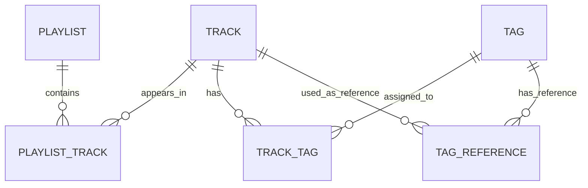

# Database Guide

Smart Music Organizer uses SQLite with SQLAlchemy to store local music library metadata.

The database stores metadata about tracks, playlists, tags, and relationships between them. The actual audio files stay on the user's filesystem. The database stores information needed to find, organize, play, and manage those files.

## Database Responsibilities

The database is responsible for storing:

* track metadata
* playlist metadata
* playlist-track relationships
* tags
* track-tag relationships
* tag reference data
* audio analysis fields when available
* app metadata needed to rebuild the library state

The database is not responsible for storing the actual music files.

Audio files remain in the user's music folder. The backend resolves and streams those files when needed.

## Database Technology

The backend uses:

* SQLite for local persistence
* SQLAlchemy for ORM models and database access

SQLite fits this project because the app is local-first and personal. It does not require a separate database server.

## Database Locations

Development mode may use:

```text
backend/data/app.db
```

Docker mode may use:

```text
data/app.db
```

Docker and development mode can use different database files. If the app looks empty in Docker but has data in development mode, check which database path is being used.

## SQLAlchemy Setup

The database layer should include:

* SQLAlchemy engine setup
* database session creation
* dependency used by FastAPI routes
* model definitions
* table creation or migration behavior

Important backend files to verify:

```text
backend/app/database.py
backend/app/models/
backend/app/settings.py
```

## Main Data Model

The core database model is organized around tracks, playlists, and tags.



## Track

A `Track` represents one music file in the library.

The track record stores metadata about the file, but not the audio file itself.

Important fields may include:

| Field         | Purpose                            |
| ------------- | ---------------------------------- |
| `id`          | Unique track ID                    |
| `title`       | Track title                        |
| `artist`      | Track artist                       |
| `album`       | Track album                        |
| `duration`    | Track length                       |
| `file_path`   | Location of the audio file on disk |
| `folder_path` | Folder containing the track        |
| `art_path`    | Artwork file path when available   |
| `bpm`         | Beats per minute when available    |
| `energy`      | Energy score when available        |
| `loudness`    | Loudness value when available      |

Verify the exact fields in the real SQLAlchemy model before editing this list.

### Track Ownership Rules

The `Track` table is central to the app.

Many features depend on it:

* library display
* playback
* playlist creation
* tag assignment
* AI playlist generation
* offline/mobile downloads
* artwork display

Changing the track model can affect many frontend and backend flows.

## Playlist

A `Playlist` represents a user-created playlist.

Important fields may include:

| Field         | Purpose                       |
| ------------- | ----------------------------- |
| `id`          | Unique playlist ID            |
| `name`        | Playlist name                 |
| `description` | Optional playlist description |
| `created_at`  | Creation timestamp            |
| `updated_at`  | Last update timestamp         |

Verify exact fields in the real model.

## PlaylistTrack

`PlaylistTrack` is a join table between playlists and tracks.

It allows one playlist to contain many tracks and one track to appear in many playlists.

```text
Playlist
  ↓
PlaylistTrack
  ↓
Track
```

This relationship is needed because playlists and tracks have a many-to-many relationship.

Important fields may include:

| Field         | Purpose                                   |
| ------------- | ----------------------------------------- |
| `playlist_id` | Playlist reference                        |
| `track_id`    | Track reference                           |
| `position`    | Track order in the playlist, if supported |

## Tag

A `Tag` represents a controlled label used to organize music.

Examples may include mood, genre, energy, or custom organization tags.

Important fields may include:

| Field  | Purpose       |
| ------ | ------------- |
| `id`   | Unique tag ID |
| `name` | Tag name      |

Tags are used by:

* manual organization
* inferred tagging
* AI playlist logic
* filtering or recommendation features

## TrackTag

`TrackTag` is a join table between tracks and tags.

It allows one track to have many tags and one tag to apply to many tracks.

```text
Track
  ↓
TrackTag
  ↓
Tag
```

This relationship supports flexible music organization.

Important fields may include:

| Field        | Purpose                               |
| ------------ | ------------------------------------- |
| `track_id`   | Track reference                       |
| `tag_id`     | Tag reference                         |
| `source`     | Where the tag came from, if supported |
| `confidence` | Confidence score, if supported        |

Verify exact fields in the real model.

## TagReference

`TagReference` stores tracks that act as positive or negative examples for a tag.

This supports tag learning, tag inference, or comparison-based tagging.

Important fields may include:

| Field      | Purpose                                          |
| ---------- | ------------------------------------------------ |
| `tag_id`   | Tag reference                                    |
| `track_id` | Track reference                                  |
| `label`    | Whether this is a positive or negative reference |

Expected labels:

```text
positive
negative
```

A database constraint should prevent invalid labels.

A uniqueness constraint may prevent the same track from being added more than once as a reference for the same tag.

## Important Constraints

Database constraints protect data integrity.

Examples of important constraints:

| Constraint Type      | Why It Matters                                   |
| -------------------- | ------------------------------------------------ |
| Foreign keys         | Keep relationships valid                         |
| Unique constraints   | Prevent duplicate relationships                  |
| Check constraints    | Restrict values such as positive/negative labels |
| Non-null constraints | Require important fields                         |

Example:

```text
TagReference.label should only allow:
- positive
- negative
```

This prevents invalid reference labels from entering the database.

## How Features Use The Database

### Library

The library reads `Track` rows from the database and displays them in the frontend.

Detailed flow:

```text
docs/features/library.md
```

### Playback

Playback uses the `Track` record to resolve the audio file path, then the backend streams the file.

Detailed flow:

```text
docs/features/playback.md
```

### Library Scanning

Scanning creates or updates `Track` records after reading music files from disk.

Detailed flow:

```text
docs/features/library-scanning.md
```

### Playlists

Playlists use `Playlist` and `PlaylistTrack` records.

Detailed flow:

```text
docs/features/playlists.md
```

### Tags

Tags use `Tag`, `TrackTag`, and `TagReference` records.

Detailed flow:

```text
docs/features/tagging-system.md
```

### AI Playlists

AI playlist generation reads track metadata, audio fields, and tags to choose tracks.

Detailed flow:

```text
docs/features/ai-playlists.md
```

### Offline Mobile

Offline mobile flows may copy track metadata into local mobile storage so downloaded tracks can be shown without the desktop backend.

Detailed flow:

```text
docs/features/offline-mobile.md
```

## Schema Change Rules

Changing the database schema can break backend routes, frontend assumptions, tests, and existing user data.

Before changing a model:

1. Identify which features use the model.
2. Search for the field or model name across the codebase.
3. Check backend tests.
4. Check frontend response expectations.
5. Decide whether existing data needs migration.
6. Make one small schema change.
7. Update affected routes/services.
8. Update tests.
9. Update this document.

Useful search commands:

```powershell
rg "class Track" backend
rg "class Playlist" backend
rg "class Tag" backend
rg "file_path" backend frontend
rg "playlist_id" backend frontend
rg "tag_id" backend frontend
```

## Inspecting The Database

To inspect the SQLite database directly, use a SQLite browser or the SQLite CLI if installed.

Example with SQLite CLI:

```powershell
sqlite3 backend\data\app.db ".tables"
sqlite3 backend\data\app.db ".schema tracks"
```

For Docker mode, inspect:

```powershell
sqlite3 data\app.db ".tables"
```

The exact table names may differ from model names. Check the SQLAlchemy models for the source of truth.

## Debugging Database Issues

### App shows no tracks

Check:

* which database file the backend is using
* whether tracks exist in the database
* whether Docker and development mode are using different database files
* whether the frontend is calling the correct backend

### Track exists but does not play

Check:

* the track row exists
* the file path still points to a real file
* the backend can resolve and validate the path
* the stream route can access the file

### Playlist looks empty

Check:

* the playlist exists
* playlist-track join rows exist
* the related track IDs still exist
* the backend route is returning playlist tracks correctly

### Tags do not appear

Check:

* the tag exists
* track-tag join rows exist
* the frontend expects the same response shape the backend returns
* inferred/manual tag sources are handled correctly

## Ownership Checklist

To own the database layer, I should be able to answer:

* Where is the database file in development mode?
* Where is the database file in Docker mode?
* Which file creates the SQLAlchemy engine?
* Which file defines the database session dependency?
* Where are the SQLAlchemy models?
* What does the `Track` model store?
* How are playlists connected to tracks?
* How are tags connected to tracks?
* What does `TagReference` do?
* Which fields are safe to expose to the frontend?
* Which fields should stay private or hidden by default?
* What breaks if I rename a database field?
* What tests prove database-related behavior still works?

## Rebuild From Memory

To recreate the database layer from scratch, I would need:

1. A SQLite database file.
2. A SQLAlchemy engine.
3. A session factory.
4. A FastAPI database dependency.
5. A `Track` model.
6. A `Playlist` model.
7. A `PlaylistTrack` join model.
8. A `Tag` model.
9. A `TrackTag` join model.
10. A `TagReference` model.
11. Routes/services that query and update these models.
12. Tests that protect important behavior.

## Future Database Improvements

Possible improvements:

* add proper migrations if schema changes become frequent
* improve indexing for large music libraries
* add clearer constraints around duplicate tracks
* add better metadata sync support for offline mobile mode
* document exact table schemas after auditing the real SQLAlchemy models
* add more tests around playlist-track and tag-track relationships